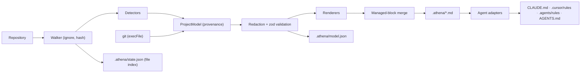

# Athena Architecture

Athena is a local-first **project intelligence layer** for AI coding agents. It analyzes a repository, keeps a structured model of what it found (with provenance), renders that model as human-readable Markdown in `.athena/`, and configures coding agents to use it.

Athena does not replace coding agents. It does not claim that code is secure, correct or complete.

## Principles

1. **Structured model first, Markdown second.** Detectors produce a typed `ProjectModel`. Markdown is a *rendering* of that model. The project graph, context engine and MCP server (later phases) build on the model, not on parsed Markdown.
2. **No hallucinated facts.** Every fact carries `status` (`FACT` · `DETECTED` · `INFERRED` · `UNKNOWN`), `confidence`, `source` and `evidence` (file/line). Renderers print `UNKNOWN` explicitly rather than omitting it. AI output (Phase 6) is capped at `INFERRED`.
3. **The developer owns the knowledge.** Generated content lives inside `athena:generated` markers. Everything outside them is never modified. Edits inside a marker are detected by hash and preserved unless `--force` is passed. `rules.md` is created once and never regenerated.
4. **Local and safe by default.** No network access, no AI required for analysis. Secrets are redacted before anything is written.
5. **Agent-agnostic core.** `src/core` knows nothing about specific agents. A test enforces this.

## Layout

```text
src/
├── core/                      # agent- and provider-agnostic
│   ├── model/                 # zod schemas: Provenance, ProjectModel
│   ├── fs/walker.ts           # ignore-aware, symlink-safe, binary/size-aware walker + hashing
│   ├── analyzer/
│   │   ├── analyze.ts         # orchestrates walk → detectors → git → redaction → validation
│   │   ├── context.ts         # Detector interface, cached file access
│   │   ├── catalog.ts         # dependency → capability table (10 ecosystems)
│   │   └── detectors/         # structure, manifests, dependencies, env, infra, tests,
│   │                          # database, routes, auth, entrypoints, secrets
│   ├── security/secrets.ts    # secret scanner + redactor
│   ├── git/git.ts             # execFile-only git access (never a shell)
│   ├── knowledge/             # document registry, relevance map, renderers,
│   │                          # managed-block merge, rules.md round-trip parser
│   ├── state/state.ts         # state.json schema, atomic writes, file index diff
│   ├── impact/impact.ts       # changed path → affected documents
│   └── agents/adapter.ts      # AgentAdapter interface only
├── agents/                    # adapters: claude-code, cursor, antigravity, agents-md
└── cli/                       # commander CLI, pipeline, terminal UI
```

## Data flow



## `.athena/` contents

| File | Owner | Committed? |
|---|---|---|
| `project.md` … `deployment.md` | Generated sections + developer notes | Yes (recommended) |
| `rules.md` | Developer | Yes |
| `config.json` (optional) | Developer: `ignore`, `include`, `maxFileBytes`, `maxFiles` | Yes |
| `model.json` | Athena (structured model) | No (`.athena/.gitignore`) |
| `state.json` | Athena (file index, doc hashes, agent config) | No |
| `.backup/` | Corrupted state backups | No |

Generated Markdown contains no timestamps, so re-running `athena analyze` on an unchanged project produces byte-identical files. The Git history of `.athena/*.md` is the knowledge history.

## Detectors

Detectors run in a fixed order because later detectors read earlier results. For example, `routes` uses the frameworks from `dependencies`. A failing detector becomes a warning; it never aborts the analysis. Each detector has a `version`, recorded in `state.json`, so incremental sync (Phase 3) can invalidate stale output.

Parsing strategy:
- Manifests: real parsers (JSON, `smol-toml`, `yaml`), plus narrow scans for XML and Gradle.
- JS/TS routes: Babel AST with error recovery (Express, Fastify, Koa, Hono, NestJS decorators).
- Other languages: conservative regexes, always `DETECTED · medium` with file:line evidence.
- Schema: Prisma models/relations/indexes, SQL DDL (tables, columns, FKs, indexes), Django, SQLAlchemy/SQLModel, Mongoose.

`web-tree-sitter` (WASM, no native builds) is the planned route to deeper multi-language parsing for the project graph.

## Agent integrations

Each adapter uses the agent's own documented mechanism:

| Agent | Mechanism | Ownership |
|---|---|---|
| Claude Code | `CLAUDE.md` block with `@.athena/rules.md` import | Marked block in a user file |
| Cursor | `.cursor/rules/athena.mdc` (`alwaysApply: true`) | Athena-owned file |
| Antigravity | `.agents/rules/athena.md` (12,000-character limit) | Athena-owned file |
| AGENTS.md | Marked block (cross-tool convention) | Marked block in a user file |

Instruction text is shared (`src/agents/common/instructions.ts`) and contains a **relevance map** (`core/knowledge/documents.ts`). Agents load only the documents relevant to the task instead of all twelve. Adapters never overwrite a user file that sits at an Athena-owned path, and never write through symlinks.

`init` configures agents detected in the project plus `AGENTS.md`; others are opt-in (`--agents`, `athena agents add`).

## Safety properties (tested)

- No secret value appears in `.athena/` or `model.json`. Env files are never read; only variable names are recorded.
- Paths are resolved inside the project root. Symlinks leaving the root are not followed, and symlink loops terminate.
- Fresh `init` writes to `.athena.tmp-*` and renames on success, so Ctrl+C leaves nothing behind (exit 130).
- Corrupted `state.json` is moved to `.athena/.backup/` and rebuilt.
- Developer edits (inside and outside generated sections) survive `analyze`.

## Decisions

See `docs/adr/`.
