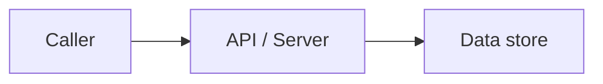

# Architecture

<!-- athena:generated:start id=about hash=4fa16327a786 -->
> **Purpose:** System and module architecture, service relationships, data flow and external services.
>
> Generated by Athena from repository analysis. Content between `athena:generated` markers is refreshed by `athena analyze`; if you edit inside a marker, Athena keeps your edit and stops refreshing that section (use `--force` to regenerate). Everything outside the markers is yours.
>
> **Status legend** — `FACT`: declared or developer-asserted · `DETECTED`: found by analysis, with evidence · `INFERRED`: heuristic, verify before relying on it · `UNKNOWN`: could not be determined.
<!-- athena:generated:end id=about -->

<!-- athena:generated:start id=overview hash=d0f25301d2d0 -->
## System Overview

- Server/API layer: Express — DETECTED
- Data layer: Prisma, postgresql (Prisma datasource) — DETECTED

_Layer membership is based on declared dependencies. How components interact at runtime is not verified by static analysis._
<!-- athena:generated:end id=overview -->

<!-- athena:generated:start id=modules hash=7b633acea804 -->
## Modules

Top-level directories: `prisma`, `src`, `tests`

**Module boundaries and responsibilities:** UNKNOWN — describe them in Developer Notes
<!-- athena:generated:end id=modules -->

<!-- athena:generated:start id=services hash=f1262dd9ba39 -->
## Service Topology

_No container orchestration (compose) detected._ Runtime service topology: **UNKNOWN**.
<!-- athena:generated:end id=services -->

<!-- athena:generated:start id=data-flow hash=74f0eee7c347 -->
## Data Flow

_INFERRED from server and data-layer dependencies._
<!-- athena:generated:end id=data-flow -->

<!-- athena:generated:start id=external-services hash=7b10fdae4ea3 -->
## External Services

_No external service integrations detected._ Status: **UNKNOWN** (absence of detection is not proof of absence).

_Only services identifiable from dependencies/config are listed. Third-party APIs called over plain HTTP are not detected in this version._
<!-- athena:generated:end id=external-services -->

<!-- athena:generated:start id=decisions hash=35ee72f5adb2 -->
## Architectural Decisions

_Athena does not infer architectural decisions. Record them in Developer Notes (or link ADRs) so agents can respect them._
<!-- athena:generated:end id=decisions -->

## Developer Notes

<!-- Knowledge Athena cannot detect: decisions, conventions, known issues, gotchas. Athena never modifies this section. -->
